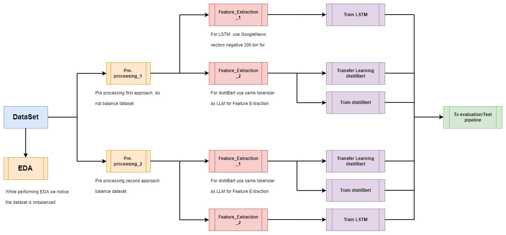

# Financial_Sentiment_Analysis
This project addresses the task of Sentiment Analysis in a Financial News Dataset from Kaggle. The main objective of this repository is to compare how LSTM and Transformers (distilBERT specifically) have different performances.

## Table of Contents
### Working Pipeline
### distilBERT approach
### LSTM approach

## Working Pipeline

## distilBERT approach
The distilBERT approach is executing fine tunning to the distilBERT model fetched from huggingface. This approach showed a higher performance achieving 97% accuracy and 97% f1-score.
